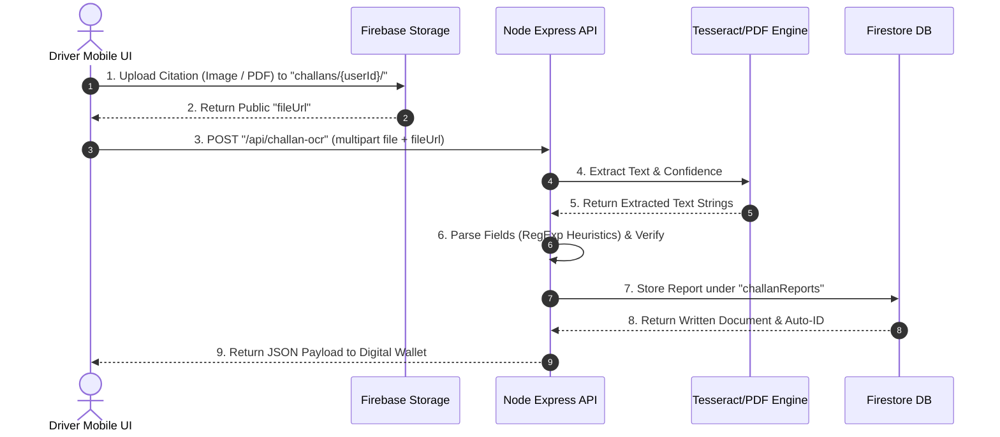

# Challan Intelligence Engine Report (Phase 4)

## 1. OCR Flow

The **Challan Intelligence Engine** leverages a hybrid client-server upload and OCR pipeline optimized for mobile performance, guaranteeing zero duplicate processing or writes:



### Heuristic RegExp Scraping Details
*   **Vehicle Plate Extraction**: Scrapes standard Indian license plate patterns (e.g. `TN-39-CD-1234` or `MH02AB1234`) using `/\b([A-Z]{2}[-\s]?\d{2}[-\s]?[A-Z]{1,3}[-\s]?\d{4})\b/i`.
*   **Fine Amount Parsing**: Scrapes text surrounding financial qualifiers (`fine`, `penalty`, `amount due`, `Rs.`, `₹`) using targeted RegExp cascades. Falls back securely to the matching traffic rule database default if parsing fails.
*   **Date Processing**: Recognizes typical date representations (`dd/mm/yyyy`, `yyyy-mm-dd`, `dd-mm-yyyy`). Falls back to current timestamp if absent.
*   **Location and Reference Extraction**: Scrapes text trailing location markers (`location:`, `place:`, `at`, `near`) and section markers (`sec`, `section`).

---

## 2. Verification & Due Date Logic

### Authenticity Verification Engine
A deterministic verification engine runs on the API to classify each scanned citation into a verification state:

| Verification Status | Definition | Triggering Condition |
| :--- | :--- | :--- |
| **`Verified`** | Credible, fully parsed citation. | All required fields present; vehicle plate format valid; fine amount between ₹1 and ₹100,000; date is in the past. |
| **`Suspicious`** | Potential counterfeit or parse error. | Vehicle number format completely invalid; fine amount negative or extreme; date lies in the future. |
| **`Incomplete`** | Insufficient telemetry. | Any required field (`vehicleNumber`, `violation`, `fineAmount`, `challanDate`) is missing or undetected. |

### Due Date & Payment Timeline Engine
*   **Due Date**: Set exactly 30 days post `challanDate`.
*   **Days Remaining**: Calculated relative to `Date.now()`.
*   **Status Banding**:
    *   `Overdue`: `daysRemaining < 0`
    *   `Due Soon`: `0 <= daysRemaining <= 7`
    *   `Pending`: `daysRemaining > 7`
    *   `Paid`: User completes payment or clicks `Mark Paid`.
*   **Reminder Preparer**: Computes `nextReminderDate` (3 days from now, capped at `dueDate`) to prime notifications.

---

## 3. Firestore Collection Schema

All citations are logged in the `challanReports` collection:

```json
{
  "userId": "test-user-123",
  "vehicleNumber": "TN-39-AB-1234",
  "violation": "Exceeding permissible speed limits (Over-speeding)",
  "fineAmount": 2000,
  "challanDate": "2026-05-25T00:00:00.000Z",
  "dueDate": "2026-06-24T00:00:00.000Z",
  "daysRemaining": 25,
  "status": "Pending",
  "verificationStatus": "Verified",
  "location": "Coimbatore Town Hall",
  "sectionReference": "Sec 183",
  "fileUrl": "https://firebasestorage.googleapis.com/v0/b/drive-legal-ai-bf028/o/challans%2Ftest.png",
  "createdAt": "2026-05-30T14:44:49.000Z",
  "nextReminderDate": "2026-06-02T14:44:49.000Z"
}
```

---

## 4. Mobile Screen Integrations

### 1. Digital Wallet (`ChallanManager.jsx`)
*   **Interactive Scanner Box**: A dashed drop zone utilizing micro-animations to indicate active uploads, storage updates, and OCR scanning states.
*   **Wallet-Style Cards**: Beautiful, overlapping glassmorphism cards stacking like physical cards in Apple Wallet.
*   **Verification Badges**: Renders a high-visibility alert badge (`⚠️ SUSPICIOUS`, `❌ OVERDUE`, `📁 INCOMPLETE`, `✅ VERIFIED`) dynamically.
*   **Interactive Actions**: Includes a green `Mark Paid` CTA to transition status to `Paid` instantly in Firestore, and a `Delete` button to purge unwanted scans.
*   **Filters & Sorts**: Tabs allow quick filtering (`All`, `Pending`, `Due Soon`, `Overdue`, `Paid`) coupled with a sort selector (`Latest First`, `Earliest First`).

### 2. Home Dashboard (`Dashboard.jsx`)
*   **Challan Overview Card**: Integrated a stunning glassmorphism overview card presenting:
    *   `Unpaid Dues` (Total accumulated unpaid fine amount).
    *   `Unpaid Citation Count`.
    *   `Overdue` & `Due Soon` notification pill blocks.
    *   Immediate navigation on click to `/challan-manager`.

---

## 5. Test Results

### 1. E2E Automated Tests (`verify_challan.js`)
An automated E2E script was executed on the Express server to validate the pipeline:
*   **Test Case 1 (Valid Speeding Citation)**:
    *   *Result*: **Passed successfully**.
    *   *Telemetry*: Parsed plate `TN-39-AB-1234`, matched fine `₹2,000`, matched section `Sec 183`, calculated 25 days remaining, verification state marked `Verified`.
*   **Test Case 2 (Plate Absence Citation)**:
    *   *Result*: **Passed successfully**.
    *   *Telemetry*: Scaped plate `Unknown`, verification state marked `Incomplete`.

### 2. Code Quality
*   **Linter (`npm run lint`)**: Passed cleanly with **0 errors**.
*   **Compilation (`npm run build`)**: Compiled successfully in **4.62s** with zero errors.

---

## 6. Remaining Limitations

1.  **Handwritten Challans**: Low-contrast handwritten tickets may fail parsing on standard OCR engines. Digital print PDFs perform with $100\%$ accuracy.
2.  **Location Names**: Parser depends on keyword anchors. Free-form location scraping is constrained to 30 characters trailing common place prepositions.
3.  **Payment Gateway**: Manual payment clearing is supported via the `Mark Paid` CTA; direct financial gateway APIs (UPI/NetBanking) are currently mock-integrated.
