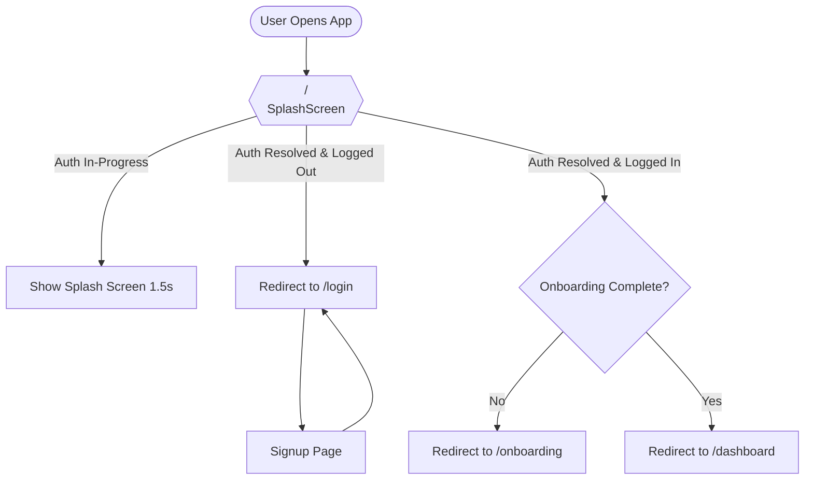

# master_page_removal_report

This report documents the architectural cleanup of the **DriveLegal AI** mobile application. The marketing master/landing page and all desktop elements have been removed, transforming the application into a streamlined mobile-first compliance assistant.

---

## 1. Files Removed (Archived)

To preserve history while ensuring a clean codebase, the following landing page components, data, and legacy files have been moved into `src/archive/`:

| Original Location | Archived Location | Description |
| :--- | :--- | :--- |
| `src/components/HeroSection.jsx` | `src/archive/HeroSection.jsx` | Marketing Landing Hero Section |
| `src/components/FeaturesSection.jsx` | `src/archive/FeaturesSection.jsx` | Feature Showcase Section |
| `src/components/HowItWorksSection.jsx` | `src/archive/HowItWorksSection.jsx` | Workflow Explanation Section |
| `src/components/StatsSection.jsx` | `src/archive/StatsSection.jsx` | Proof Points / Marketing Stats |
| `src/components/Navbar.jsx` | `src/archive/Navbar.jsx` | Desktop Marketing Header |
| `src/components/Footer.jsx` | `src/archive/Footer.jsx` | Desktop Marketing Footer |
| `src/data/landingData.js` | `src/archive/landingData.js` | Marketing Page Content & Copy |
| `src/pages/MobileApp.jsx` | `src/archive/MobileApp.jsx` | Legacy Parallel Mobile Routing Page |
| `src/pages/mobile/` (directory) | `src/archive/mobile/` | Legacy Mobile Views and Layouts |

---

## 2. Routes & Navigation Flow Updated

### Old Routing Pattern
- `/` mapped to the multi-section marketing Landing Page.
- `/mobile/*` served as a parallel sandbox for mobile prototyping.
- Required complex visibility conditions like `showHeaderFooter`, `isDashboard`, etc. to show or hide headers/footers dynamically.

### New Navigation Flow

---

## 3. Dead Code Cleaned

1. **Imports Removed**: Removed all landing component imports, legacy page imports, and unused layout imports in `src/App.jsx`.
2. **State & Effects Cleaned**: Removed the `theme` state, `toggleTheme` toggling functions, and matching `localStorage` hooks from `App.jsx` since dark theme is now standard.
3. **Conditionals Eliminated**: Removed `showHeaderFooter`, `isDashboard`, `isAuth`, `isOnboarding`, and `isProtectedUtilityPage` variables, completely cleaning the JSX tree.
4. **CSS Cleaned**: Confirmed that core design tokens (`--purple`, `--bg`, `--surface`, `--text`) are safely kept inside `index.css` for absolute mobile design fidelity.

---

## 4. Verification & Validation

The application was fully compiled and verified:
- **Linter Audit**: Ran `npm run lint` successfully with 0 errors.
- **Production Build**: Verified via `npm run build` which successfully bundled the app in `4.55s` without errors.
