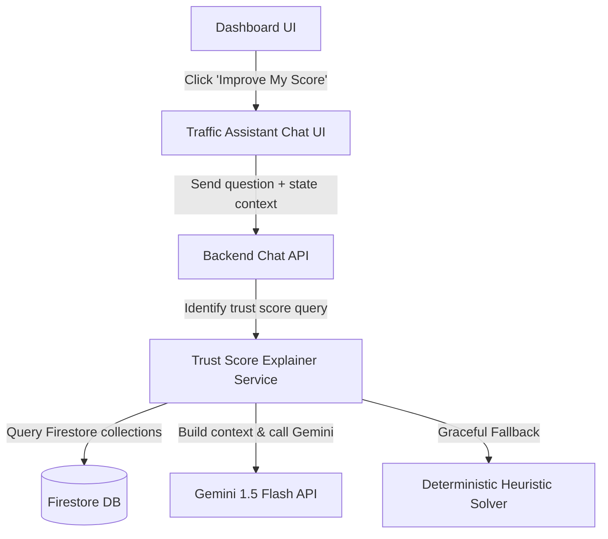

# Phase 12 — Driver Trust Score AI Explainer Integration Report

## 1. Goal & Overview
The objective of this phase is to integrate the **Gemini Traffic Assistant** with the **Driver Trust Score Engine**. This allows drivers to query the AI assistant regarding their legal standing, compliance status, and trust score metrics, receiving explanations grounded strictly in their actual database profile.

---

## 2. System Architecture & Components
The integration spans both backend and frontend layers:

---

## 3. Data Retrieval & Grounding Context
The backend service [trustScoreExplainer.js](file:///D:/Drive_Legal_Ai/backend/services/trustScoreExplainer.js) queries the following Firestore collections using the authenticated driver's `userId` to construct the grounding context:

1. **`trustScores`**: Current trust score ($300-900$ range), grade classification, level, and primary engine-computed positive/negative factors.
2. **`trustScoreHistory`**: History of changes to deconstruct recent score shifts, increases, or decreases.
3. **`drivingSessions`**: Last 5 completed driving sessions to check for speeding warnings, off-route flags, and average safety ratings.
4. **`challanReports`**: Unpaid, overdue, or suspicious traffic citation logs.
5. **`documents`**: Credential expiry statuses from the vault (License, Insurance, PUC, RC, FC).

---

## 4. Implementation Details

### A. Backend Explainer Service
A dedicated service [trustScoreExplainer.js](file:///D:/Drive_Legal_Ai/backend/services/trustScoreExplainer.js) was created. It aggregates driver statistics, implements strict grounding system instructions, and queries the Gemini 1.5 Flash API. If the API key is missing or the external API call fails, the explainer falls back to a **Deterministic Heuristic Solver** to guarantee reliable, data-grounded responses in all environments.

### B. Route Orchestration
The chatbot service [trafficAssistantService.js](file:///D:/Drive_Legal_Ai/backend/services/trafficAssistantService.js) checks if incoming questions are trust score-specific. If matched, it delegates execution to the explainer service:
- Intercepts questions containing terms like `trust score`, `improve my score`, `level`, `score low`, `score decrease`.
- Builds driver context and routes queries to `explainTrustScoreWithGemini`.

### C. Dashboard "Improve My Score" Button
In [Dashboard.jsx](file:///D:/Drive_Legal_Ai/frontend/src/pages/Dashboard.jsx), a premium glassmorphic button labeled **"Improve My Score"** was added to the bottom of the Trust Score Card. 
- Clicking it navigates to the **Traffic Assistant Chat** (`/traffic-assistant-chat`), passing the pre-selected query: *"How do I improve my score?"* in the React Router navigation state.
- The chat page [TrafficAssistantChat.jsx](file:///D:/Drive_Legal_Ai/frontend/src/pages/TrafficAssistantChat.jsx) reads this navigation state on mount and automatically submits it, presenting the AI-guided steps instantly.

---

## 5. Verification & Testing

1. **Linting Verification**: 
   Ran `npm run lint` in the `frontend` directory. The codebase contains **0 errors** and only minor unused imports / React-hooks dependency warnings.
2. **Build Verification**:
   Ran `npm run build` in the `frontend` directory. The compilation completed successfully in 6.43s, generating a production-ready package in the `dist/` directory.

---

## 6. AI Response Rules Enforcement
The system guarantees the following parameters:
- **No Hallucinations**: Only actual database metrics are injected.
- **Cite Factors**: Explanations explicitly cite which factors (e.g. *expired PUC*, *active speeding warnings*, or *consistency session count*) are driving the score.
- **Accurate Next Level Math**: Calculates the exact points needed to reach the next tier based on the standard rules bounds.
